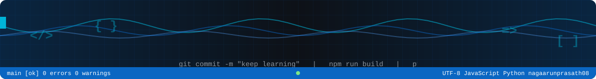

<!--
  Profile README for nagaarunprasath08 (technical animated header + footer)
  Repo layout:   README.md
                 assets/header.svg
                 assets/footer.svg
-->

  

  
  
  

---

## About

Junior software developer with hands-on experience in the **MERN stack** and **Python**. I build full-stack web applications, from responsive React front ends to REST APIs and database design, and I'm always improving my code quality and problem-solving skills.

| Focus | Approach | Status |
| :-- | :-- | :-- |
| Full-stack web development (MERN) and Python | Clean, readable code and component-based design | Open to opportunities and collaboration |

---

## Technology Stack

  

| Area | Tools |
| :-- | :-- |
| **Languages** | JavaScript, Python, HTML, CSS |
| **Front end** | React, responsive UI |
| **Back end** | Node.js, Express, REST APIs |
| **Database** | MongoDB |
| **Tools** | Git, GitHub, VS Code, Netlify |

---

## Featured Projects

| Project | Description |
| :-- | :-- |
| [**portfolio**](https://github.com/nagaarunprasath08/portfolio) | Personal portfolio website, live at [nagaarun.netlify.app](https://nagaarun.netlify.app/) |
| [**alumni-project**](https://github.com/nagaarunprasath08/alumni-project) | Alumni management web application |
| [**quiz-app-2.0**](https://github.com/nagaarunprasath08/quiz-app-2.0) | Interactive quiz application |
| [**quiz-app-using-supervised-learning-**](https://github.com/nagaarunprasath08/quiz-app-using-supervised-learning-) | Quiz app built around a supervised learning approach |
| [**chat**](https://github.com/nagaarunprasath08/chat) | Chat application |
| [**AAC-FHUB**](https://github.com/nagaarunprasath08/AAC-FHUB) | Community / hub project |

---

## GitHub Analytics

  

  
  

  
  

  

---

## Let's Connect

  
  
  <!-- Add yours: -->
  <!--  -->
  <!--  -->

  

