<div align="center">



<a href="https://nagaarun.netlify.app/"></a>


</div>


## `> whoami`

```python
class Developer:
    name     = "Naga Arun Prasath"
    role     = "Junior Software Developer"
    stack    = ["MERN", "Python"]
    learning = ["TypeScript", "Docker", "Machine Learning"]
    portfolio = "https://nagaarun.netlify.app"

    def __str__(self):
        return "Turning ideas into working code 🚀"
```

## `> cat skills.json`

<div align="center">


</div>

## `> ls projects/`

<table>
  <tr>
    <td width="50%">
      <h3>📚 <a href="https://github.com/nagaarunprasath08/alumni-project">alumni-project</a></h3>
      <sub>Alumni platform · JavaScript</sub>
    </td>
    <td width="50%">
      <h3>💬 <a href="https://github.com/nagaarunprasath08/chat">chat</a></h3>
      <sub>Chat application</sub>
    </td>
  </tr>
  <tr>
    <td>
      <h3>🧠 <a href="https://github.com/nagaarunprasath08/quiz-app-using-supervised-learning-">quiz-app-using-supervised-learning</a></h3>
      <sub>Quiz app + ML · JavaScript</sub>
    </td>
    <td>
      <h3>❓ <a href="https://github.com/nagaarunprasath08/quiz-app-2.0">quiz-app-2.0</a></h3>
      <sub>Interactive quiz app · JavaScript</sub>
    </td>
  </tr>
  <tr>
    <td>
      <h3>🛠️ <a href="https://github.com/nagaarunprasath08/AAC-FHUB">AAC-FHUB</a></h3>
      <sub>Add your description here</sub>
    </td>
    <td>
      <h3>🌐 <a href="https://github.com/nagaarunprasath08/portfolio">portfolio</a></h3>
      <sub>Personal portfolio site · JavaScript</sub>
    </td>
  </tr>
</table>

## `> git log --stats`

<div align="center">


</div>

## `> ping me`

<div align="center">

<a href="https://nagaarun.netlify.app/"></a>
<a href="https://www.linkedin.com/in/YOUR-LINKEDIN"></a>
<a href="mailto:YOUR-EMAIL@example.com"></a>


</div>
